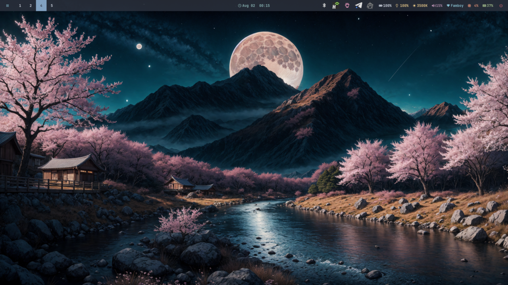
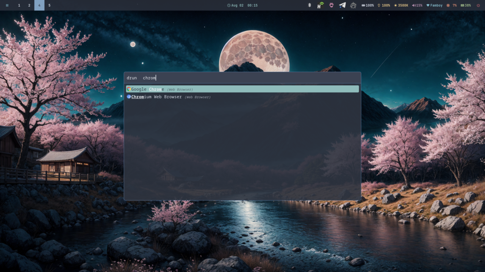
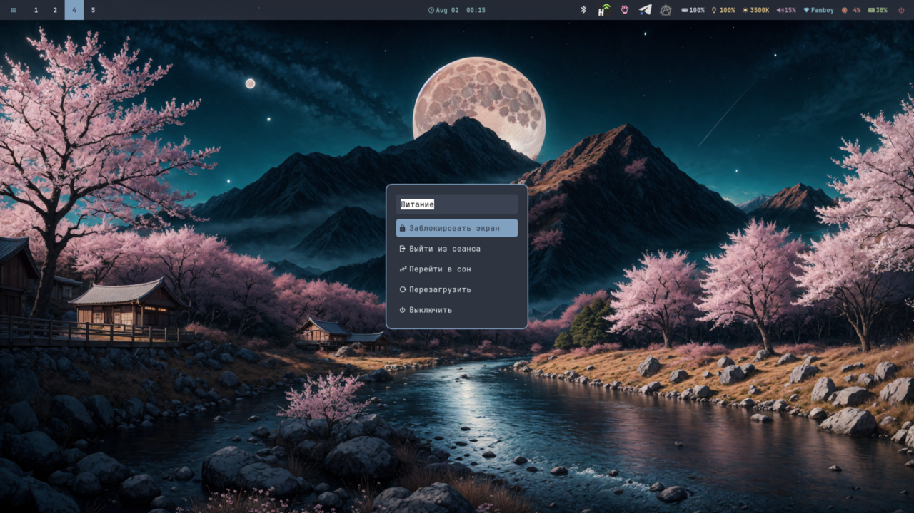
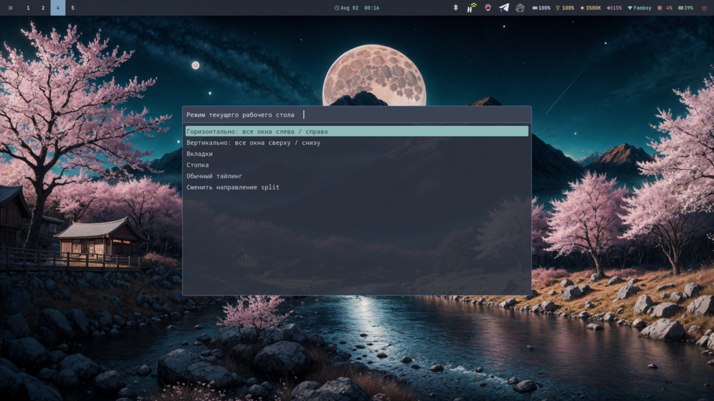
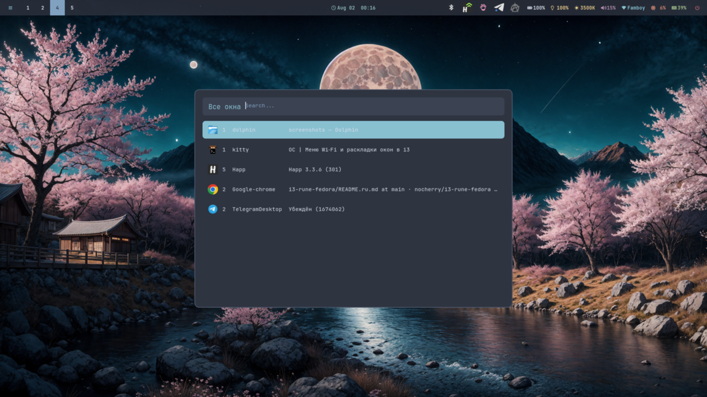
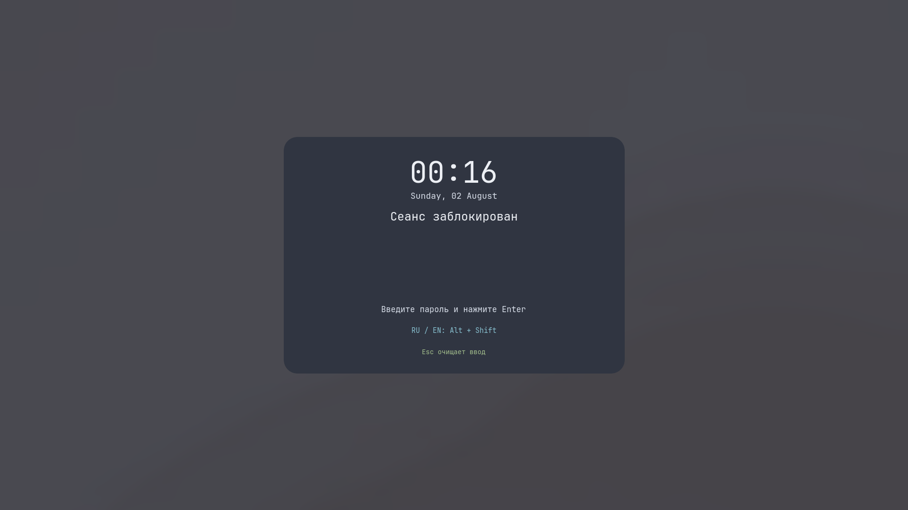

<div align="center">

# 🪟 i3wm — Fedora Adaptation

**A reproducible Nord-themed i3/X11 desktop for Fedora, with RU/EN-safe keycodes and a Hyprland-like feel.**

<p>
  <a href="./README.md"></a>
  <a href="./README.ru.md"></a>
</p>

<p>
  
  
  
  
  
</p>

<sub>Pinned to Greenclip <code>v4.2</code>, libinput-gestures <code>2e4cc4c</code>, JetBrainsMono Nerd Font <code>v3.4.0</code> — all binaries and assets are SHA-256 verified by the installer.</sub>

</div>

---

## 📚 Table of Contents

- [🎯 Why this project exists](#-why-this-project-exists)
- [✨ Features](#-features)
- [📸 Screenshots](#-screenshots)
- [⚡ Quick start](#-quick-start)
- [🧰 What gets installed](#-what-gets-installed)
- [🖱️ Keybindings](#️-keybindings)
- [🎨 What you'll see](#-what-youll-see)
- [⚙️ How it works](#️-how-it-works)
- [🛠️ Day-to-day usage](#️-day-to-day-usage)
- [🐞 Troubleshooting](#-troubleshooting)
- [🤝 Credits](#-credits)

---

<a id="-why-this-project-exists"></a>

## 🎯 Why this project exists

If you've ever tried to bring an Arch-style i3 setup to Fedora, you've hit these walls:

- 🔠 **Letter shortcuts die when you switch keyboard layout.** `Super+Q` quits a window in English but does something completely different in Russian. Every keybind is fixed by physical keycode, so the same key always fires the same action — regardless of `us`/`ru` or any other XKB layout.
- 🪟 **The bare i3lock screen is a black void.** A pause for a coffee shouldn't require a tutorial. The built-in `lock-screen.sh` shows time, date, layout hint and instructions, and uses `xsecurelock` when available.
- 🎙️ **Headphone jack detection is unreliable.** Standard PipeWire routing can't tell that you just plugged in a headset. The `audio-port-autoswitch.sh` daemon watches the actual ALSA jack control and switches the input source in real time.
- 💤 **Closing the lid sometimes leaves the screen on, sometimes fully suspends.** A single `logind.conf.d` drop-in makes lid-close consistently suspend on battery, external power, and dock.
- 🌐 **Chrome forgets Google sessions after reboot.** A tiny `xdg-desktop-portal/i3-portals.conf` makes KWallet the Secret portal so the encryption key persists.
- 🖐️ **The touchpad looks dead.** `libinput Tapping Enabled` is off by default on most laptops. `touchpad.py` re-enables it on every login via `python3-xlib` — no `xinput` package needed.
- 🟣 **Telegram becomes invisible after media playback under Picom GLX.** A per-Flatpak `QT_XCB_GL_INTEGRATION=none` override fixes the Qt OpenGL surface issue without affecting the rest of your desktop.
- 🔄 **i3 config drifts between project and active copy.** `i3 -C` validation runs before every reload; the project copy stays the source of truth.

This repo packages every fix and decision into a single `install.sh` that is **idempotent**, **safe** (every step has `--skip-unavailable` or guards), and **SHA-256 pinned** for all third-party binaries.

---

<a id="-features"></a>

## ✨ Features

| Area | What you get |
|---|---|
| 🪟 **Window manager** | i3-gaps with Nord colors, 2px borders, smart inner/outer gaps, 10px rounded corners |
| 🔤 **Keyboard** | Every letter shortcut is `bindcode`-based — works on US, RU, and any other XKB layout |
| 📊 **Polybar** | Workspaces, apps tray, volume, brightness (clicks open eye-care menu), CPU, RAM, battery with auto-detected `BAT0`/`AC0`, Wi-Fi (clickable), date |
| 🚀 **Rofi** | Nord-themed launcher with apps, run, window, filebrowser, clipboard, keybindings, powermenu, control center, eye-care |
| 🌫️ **Picom** | GLX backend with shadows, fade, blur (dual-kawase), rounded corners, animations on focus changes |
| 🔔 **Dunst** | Nord colors, `follow = mouse`, height-clamped |
| 🖥️ **Terminal** | Kitty with Catppuccin Mocha theme, padding, transparency, tabs |
| 🔐 **Lock screen** | `xsecurelock` (preferred) with date, time, username, keyboard layout and PAM feedback; `ImageMagick` + `i3lock` fallback if the package isn't installed |
| 🎙️ **Audio** | Automatic headset/internal mic switching via ALSA jack events; PipeWire/WirePlumber stack |
| 🛌 **Suspend** | Lid close + manual `Ctrl+Alt+S` both go through `xss-lock`, so the screen locks **before** systemd suspends |
| 🖐️ **Touchpad** | Tap-to-click enabled on every login; three-finger gestures switch workspaces / open window switcher / toggle scratchpad; pinch controls volume |
| 💼 **Chrome sessions** | XDG Secret portal routes to KWallet; `pam_kwallet_init` unlocks the wallet at login without storing the password anywhere |
| 🟣 **Telegram** | Flatpak override disables Qt OpenGL XCB integration to keep the window visible under Picom |
| 🪟 **Window switcher** | `Alt+Tab` lists every window from every workspace with icon + workspace + class + title |
| ⚡ **Power menu** | Russian, explicit actions: Заблокировать экран / Выйти из сеанса / Перейти в сон / Перезагрузить / Выключить |
| 🔌 **Clipboard** | Greenclip daemon with images cached to `~/.cache/greenclip-images` (private), automatic blacklist for Handy voice transcriptions |
| 🛡️ **Polkit** | Auto-detects `lxqt-policykit-agent` (preinstalled) with `polkit-gnome` fallback |
| 🎨 **Themes** | Nord for everything GTK3/Qt5/Qt6/Kvantum/Sweet/Adwaita, Papirus icon theme |
| 🖼️ **Wallpapers** | Clones [harilvfs/wallpapers](https://github.com/harilvfs/wallpapers) and picks a random one on each session, with bundled fallback |

---

<a id="-screenshots"></a>

## 📸 Screenshots

All screenshots are taken on the live desktop with a real Fedora 43 install — no mock-ups.

<details>
<summary><b>🖥️ Desktop — clean workspace</b></summary>

> Polybar with all modules (workspaces, tray, brightness, eye-care 3500K, volume, Wi-Fi, CPU 4%, battery 37%), Nord theme, Japanese landscape wallpaper from <code>harilvfs/wallpapers</code>.



</details>

<details>
<summary><b>🚀 App launcher (Rofi) — <code>Super + D</code></b></summary>

> Nord-themed Rofi with Papirus icons, fuzzy search. The screenshot shows a search for "chrom" matching Google Chrome and Chromium.



</details>

<details>
<summary><b>🔐 Power menu (Rofi) — <code>Ctrl + Alt + P</code></b></summary>

> Five explicit Russian actions: Заблокировать экран, Выйти из сеанса, Перейти в сон, Перезагрузить, Выключить. <code>Esc</code>/<code>Super+Q</code> cancel.



</details>

<details>
<summary><b>⚙️ Control center (Rofi) — <code>Super + \`</code></b></summary>

> Wi-Fi, Bluetooth, Volume, Brightness, Screen color, Screenshot, Lock, Logout, Reboot, Shutdown — all quick toggles in one menu.


</details>

<details>
<summary><b>🪟 Per-workspace layout menu (Rofi) — <code>Super + L</code> / <code>Super + Д</code></b></summary>

> Choose horizontal / vertical / tabs / stack / default tiling / toggle split direction. The command targets the current workspace's first multi-window level so it always rearranges the entire workspace, not whichever child happened to have focus.



</details>

<details>
<summary><b>↔️ Window switcher (Rofi) — <code>Alt + Tab</code></b></summary>

> Lists windows from every workspace with app icon, workspace number, class, and title. Selecting one asks i3 to focus the window — i3 automatically switches to its workspace and monitor.



</details>

<details>
<summary><b>🔒 Lock screen — <code>Ctrl + Alt + L</code></b></summary>

> Time, date, "Сеанс заблокирован", password prompt, RU/EN layout hint, and the <code>Esc</code> cue. The fallback is an ImageMagick-generated Nord overlay; if <code>xsecurelock</code> is installed, it takes over with full PAM feedback.



</details>

---

<a id="-quick-start"></a>

## ⚡ Quick start

```bash
git clone https://github.com/nocherry/i3-rune-fedora.git
cd i3-rune-fedora
./install.sh
# log out, choose "i3" at SDDM (or LightDM), log in.
```

That's it. The installer backs up your existing `~/.config`, installs every dependency via `dnf`, downloads the pinned JetBrainsMono Nerd Font and SHA-256-verifies Greenclip + libinput-gestures, copies every config, drops in the `logind` lid-suspend override, and validates `i3 -C` before returning.

> **Passwordless sudo is required** for the package install step. If `sudo` isn't configured, run `su -` and execute `./install.sh` as root in your user's home (or pre-install the dnf packages by hand).

---

<a id="-what-gets-installed"></a>

## 🧰 What gets installed

The installer adds these Fedora packages (plus `--skip-unavailable` for missing ones):

<details>
<summary><b>Click to expand the full package list</b></summary>

```
i3 polybar rofi picom dunst kitty thunar feh nitrogen
network-manager-applet blueman pavucontrol pulseaudio-utils alsa-utils
brightnessctl redshift maim flameshot playerctl
xorg-x11-server-Xorg xorg-x11-xinit xrandr xset xsetroot
gnome-keyring gnome-settings-daemon lxqt-policykit
xdg-desktop-portal xdg-desktop-portal-gtk xdg-desktop-portal-kde
kf6-kwallet pam-kwallet
neovim btop fastfetch fish zoxide eza starship yad xclip xss-lock
xsecurelock i3lock ImageMagick trash-cli libinput-utils
nwg-look qt5ct qt6ct kvantum
jetbrains-mono-fonts-all google-noto-emoji-fonts google-noto-color-emoji-fonts
fontawesome-fonts papirus-icon-theme
python3 python3-xlib unzip curl git
```

Plus a `logind.conf.d` drop-in for lid suspend, and these user-level installs:

- `~/.local/bin/greenclip` — pinned to v4.2 (SHA-256 verified)
- `~/.local/bin/libinput-gestures` — pinned to commit `2e4cc4c` (SHA-256 verified)
- `~/.local/share/fonts/JetBrainsMonoNerd/` — JetBrainsMono Nerd Font v3.4.0

</details>

### Project layout

```
i3-fedora-ready/
├── install.sh                          # one-shot installer
├── README.md                           # this file (English)
├── README.ru.md                        # Russian version
├── PRODUCT.md                          # product register
├── LOG.md                              # every decision with evidence
├── etc/
│   └── systemd/logind.conf.d/
│       └── 90-i3-fedora-lid.conf       # lid close → suspend
└── .config/
    ├── i3/
    │   ├── config                      # main i3 config
    │   └── scripts/                    # 20+ shell + python helpers
    │       ├── i3exit.sh               # lock/logout/suspend/reboot/shutdown
    │       ├── lock-screen.sh          # xsecurelock + ImageMagick fallback
    │       ├── audio-port-autoswitch.sh# ALSA jack → mic source
    │       ├── touchpad.py             # python3-xlib enable tap
    │       ├── powermenu.sh            # Ctrl+Alt+P
    │       ├── control-center.sh       # quick toggles
    │       ├── layout-menu.sh          # per-workspace tiling chooser
    │       ├── eye-care.sh             # color temperature
    │       ├── theme-toggle.sh         # dark/light
    │       ├── wallpaper.sh            # random wallpaper
    │       ├── wifi-menu.sh            # persistent rofi menu
    │       ├── configure-handy.sh      # voice-to-text setup
    │       └── …                       # and more
    ├── polybar/                        # Nord-themed bar
    ├── rofi/                           # Nord themes + per-mode themes
    ├── picom/                          # GLX rounded blur
    ├── dunst/                          # Nord notifications
    ├── kitty/                          # Catppuccin Mocha
    ├── xdg-desktop-portal/
    │   └── i3-portals.conf             # routes Secret → KWallet
    ├── nvim tmux zellij fastfetch
    ├── gtk-3.0 Kvantum qt5ct qt6ct xsettingsd
    ├── fish starship
    └── libinput-gestures.conf          # 3-finger workspace + pinch volume
```

---

<a id="-️-keybindings"></a>

## 🖱️ Keybindings

> Every letter key uses physical **keycodes**, so the same shortcut works on US, RU, or any other XKB layout. `Super+Q` is always `Super+Q`.

### 🚀 Apps & launcher

| Shortcut | Action |
|---|---|
| `Super + D` | App launcher (Rofi with icons) |
| `Super + Shift + D` | Toggle dark/light theme |
| `Super + Shift + N` | Toggle warm/neutral eye-care color |
| `Super + Shift + \`` | Clipboard history (Greenclip + Rofi) |
| `Super + Enter` | Terminal (Kitty) |
| `Super + E` | File manager (Thunar) |
| `Super + B` | Browser |
| `Super + \`` | Control center (brightness, network, audio, eye-care) |

### 🪟 Window management

| Shortcut | Action |
|---|---|
| `Super + Q` | Close active window |
| `Super + Shift + Q` | Close active window (alt binding) |
| `Super + F` | Fullscreen |
| `Super + Shift + F` | Fullscreen global |
| `Super + Space` | Toggle floating |
| `Super + Shift + Space` | Enable floating on focused window |
| `Super + L` / `Super + Д` | Per-workspace layout menu (horizontal / vertical / tabs / stack / default) |
| `Super + R` | Resize mode |
| `Super + Shift + G` | Gaps mode |
| `Alt + Tab` | Window switcher across **all** workspaces |
| `Super + U` / `Super + Shift + U` | Scratchpad show / move |
| `Super + Arrows` | Focus |
| `Super + Shift + Arrows` | Move window |

### 🗂️ Workspaces

| Shortcut | Action |
|---|---|
| `Super + 1..0` | Switch to workspace 1-10 |
| `Super + Shift + 1..0` | Move window to workspace |
| `Super + Tab` / `Super + Shift + Tab` | Next / prev workspace |
| `Super + ,` / `Super + .` | Prev / next workspace |
| `Super + Shift + [` / `Super + Shift + ]` | Switch to prev / next workspace |

### 🔐 System & session

| Shortcut | Action |
|---|---|
| `Ctrl + Alt + L` | Lock screen |
| `Ctrl + Alt + S` | Lock and suspend immediately |
| `Ctrl + Alt + Delete` | Logout (asks for confirmation) |
| `Ctrl + Alt + P` | Power menu |
| `Super + Shift + C` | Reload i3 config (validates with `i3 -C` first) |
| `Super + Shift + R` | Restart i3 |

### 🎵 Media & hardware

| Shortcut | Action |
|---|---|
| `XF86 Volume Up/Down` | Volume ±5% |
| `XF86 Mute` / `XF86 Mic Mute` | Mute audio / mic |
| `XF86 Brightness Up/Down` | Brightness ±5% |
| `XF86 Play / Next / Prev` | Media controls via `playerctl` |
| `Print` | Screenshot fullscreen |
| `Super + Print` | Screenshot area |
| `Super + Shift + Print` | Screenshot area |
| `Super + Ctrl + Print` | Screenshot after 5 s |
| `F6` | Screenshot fullscreen (laptops without Print) |
| `Super + W` | Pick a wallpaper |
| `Ctrl + Space` | Handy voice-to-text toggle (while Handy is running) |

### 🖐️ Touchpad gestures (`libinput-gestures`)

| Gesture | Action |
|---|---|
| 3 fingers ← / → | Previous / next workspace |
| 3 fingers ↑ | Window switcher across all workspaces |
| 3 fingers ↓ | Toggle scratchpad |
| 2 fingers pinch in / out | Volume −/+ 5% |

---

<a id="-what-youll-see"></a>

## 🎨 What you'll see

| | |
|---|---|
| **Top bar** | Workspace buttons, app tray, clickable Wi-Fi, brightness lamp, eye-care color indicator, volume, CPU/RAM, battery, date |
| **Launcher** | `Super + D` opens Rofi with Nord theme, app icons, search history, fast keyboard input |
| **Lock screen** | Time + date + "Сеанс заблокирован" + input field with `i3lock` indicator, or `xsecurelock` prompt with PAM feedback |
| **Power menu** | Five Russian labels with clear consequences, `Esc`/`Super+Q` cancel |
| **Window switcher** | Cross-workspace list with icon, workspace number, app class, title |

---

<a id="-️-how-it-works"></a>

## ⚙️ How it works

### 🔐 Lock screen

`i3exit.sh` doesn't run `i3lock` directly — it asks the running `xss-lock` daemon to lock the screen via `xset s activate`, then waits up to 5 seconds for `xsecurelock` (preferred) or `i3lock` (fallback) to appear. Only after the screen is secured does it trigger `systemctl suspend -i` or `systemctl hibernate -i`. The `-i` flag (`--check-inhibitors=no`) ensures apps cannot abort the sleep.

`xss-lock` is started in i3 autostart:

```
exec --no-startup-id xset s 600 10
exec --no-startup-id xss-lock --transfer-sleep-lock -- $HOME/.config/i3/scripts/lock-screen.sh
```

`lock-screen.sh` first tries `xsecurelock` (with Nord colors, JetBrainsMono Nerd Font, PAM feedback, date, keyboard layout). If `xsecurelock` isn't installed yet, it generates a 1920×1080 Nord-themed screenshot with ImageMagick (or your screen's current XRandR resolution), showing time, date, language hint, and instructions, then hands the image to `i3lock`. The image is created with `umask 077` so only your user can read it.

### 🎙️ Automatic microphone routing

The sound card (Intel HDA / Realtek ALC256 in this build) publishes one PipeWire source with two ports, but `WirePlumber` lists both as `availability unknown` and won't auto-switch. The actual state is in the ALSA control `Headphone Jack`.

`audio-port-autoswitch.sh` queries this control, picks `analog-input-headset-mic` when plugged and `analog-input-internal-mic` when unplugged, then waits for `alsactl monitor hw:0` events — no polling, no DBus, no Python. Calibration variables:

| Variable | Default | Use |
|---|---|---|
| `AUDIO_CARD` | `0` | ALSA card index |
| `AUDIO_SOURCE` | `alsa_input.pci-0000_00_1f.3.analog-stereo` | PipeWire source name |
| `HEADSET_MIC_PORT` | `analog-input-headset-mic` | Plugged port |
| `INTERNAL_MIC_PORT` | `analog-input-internal-mic` | Unplugged port |

### 🖐️ Touchpad tap & gestures

`libinput Tapping Enabled` and `Device Enabled` are reset to `1` on every i3 login by `touchpad.py` (uses `python3-xlib`, no `xinput` CLI required). For gestures, the pinned `libinput-gestures 2e4cc4c` daemon reads from `libinput-debug-events --device /dev/input/event6` and dispatches the gestures from `~/.config/libinput-gestures.conf`. Your account needs read access to `/dev/input/event6` — by default Fedora grants this to members of the `input` group. Re-login after `sudo gpasswd -a $USER input` for it to take effect.

> ⚠️ **Note about `libinput-gestures -l`**: this version's `-l/--list` flag triggers an external setup helper that deletes the standalone binary as part of its cleanup. Use `pgrep -af libinput-gestures` to check whether the daemon is alive instead.

### 💼 Chrome / KWallet auto-unlock

A Plasma-style `pam_kwallet_init` would normally run as a hidden XDG autostart, but i3 doesn't honor those. The i3 config adds:

```
exec --no-startup-id sh -c "[ -x /usr/libexec/pam_kwallet_init ] && exec /usr/libexec/pam_kwallet_init || true"
```

It transfers the password that SDDM/PAM already received (via the `/run/user/1000/kwallet5.socket`) to the running `ksecretd` process — nothing is written to disk. The companion `xdg-desktop-portal/i3-portals.conf` then routes `org.freedesktop.impl.portal.Secret` to KWallet while keeping other portals on GTK.

For the wallet password to actually unlock, **the wallet password must equal your Fedora login password**. If Chrome still forgets sessions after logout/login, run `kwalletmanager5`, open `kdewallet` → Change Password and set it to your login password.

### 🟣 Telegram under Picom

`QT_XCB_GL_INTEGRATION=none` is applied as a per-app Flatpak override:

```
flatpak override --user --env=QT_XCB_GL_INTEGRATION=none org.telegram.desktop
```

This forces Telegram to use software rendering for its X11 surface while leaving Picom GLX acceleration intact for everything else.

### 🛌 Lid close and suspend

The drop-in at `etc/systemd/logind.conf.d/90-i3-fedora-lid.conf`:

```ini
[Login]
HandleLidSwitch=suspend
HandleLidSwitchExternalPower=suspend
HandleLidSwitchDocked=suspend
LidSwitchIgnoreInhibited=yes
```

Suspends on battery, external power, and dock. Combined with `xss-lock --transfer-sleep-lock`, the screen is **always** locked before suspend.

---

<a id="-️-day-to-day-usage"></a>

## 🛠️ Day-to-day usage

### First 5 minutes

1. **Lock screen** with `Ctrl+Alt+L` — you should see time/date and instructions instead of a black circle.
2. **Unlock** and open launcher with `Super+D`.
3. **Window switcher** with `Alt+Tab` — pick a window from any workspace.
4. **Brightness lamp** in Polybar — left-click to choose eye-care color temperature.
5. **Wi-Fi name** in Polybar — left-click to open the Wi-Fi menu (persistent, only closes on `Esc`/`Super+Q`).
6. **Power menu** with `Ctrl+Alt+P` — five Russian actions, confirmation for logout/reboot/shutdown.

### Three-finger gestures

| ← / → | Switch workspaces |
|---|---|
| ↑ | Window switcher across all workspaces |
| ↓ | Scratchpad |

### Restoring from a previous install

If something breaks after a manual edit, restore from the timestamped backup:

```bash
cp -a ~/.config/i3-fedora-backup-<TIMESTAMP>/.config/. ~/.config/
cp -a ~/.config/i3-fedora-backup-<TIMESTAMP>/home/. ~/
```

### Reloading i3 safely

`Super+Shift+C` runs `reload-safe.sh`, which runs `i3 -C` first and refuses to reload if the config has syntax errors. For a hard restart: `Super+Shift+R`.

### Adding a keybinding

Open `~/.config/i3/config`, add a `bindcode $mod+NN <command>` line, then `Super+Shift+C`. The active config lives in `~/.config/i3/config`; the source of truth is the project file `.config/i3/config`. Keep them in sync with `cmp`.

---

<a id="-troubleshooting"></a>

## 🐞 Troubleshooting

### "i3: syntax error" after editing

`Super+Shift+C` already validates with `i3 -C` — if it refuses to reload, the active config is broken. Run `i3 -C -c ~/.config/i3/config` to see the error. Either fix the syntax or restore the project copy:

```bash
cp i3-fedora-ready/.config/i3/config ~/.config/i3/config
i3-msg reload
```

### Touchpad looks dead

Check whether the kernel sees it:

```bash
cat /proc/bus/input/devices | grep -A 3 ELAN
ls -l /dev/input/event*
```

If it shows up but doesn't move the cursor, run:

```bash
python3 ~/.config/i3/scripts/touchpad.py
```

This re-enables `Device Enabled` and `libinput Tapping Enabled` on the detected touchpad. If the gesture daemon died:

```bash
i3-msg 'exec --no-startup-id /home/fedora/.local/bin/libinput-gestures'
pgrep -af libinput-gestures
```

### Chrome forgets Google sessions after reboot

1. Make sure `pam-kwallet` is installed: `rpm -q pam-kwallet`.
2. Confirm the wallet exists and is unlocked: `busctl --user introspect org.freedesktop.secrets /org/freedesktop/secrets org.freedesktop.Secret.Service`.
3. If `kwalletmanager5` prompts for a password every login, open it, change the wallet password to **the same password you use to log in to Fedora**.
4. Restart Chrome completely (system tray → Quit) and log in to Google once. The new cookie will survive the next reboot.

### Headset mic doesn't switch

Run `audio-port-autoswitch.sh --self-test` to verify the source/control are detected. Override for your hardware:

```bash
AUDIO_CARD=1 HEADSET_MIC_PORT="your-port-name" ~/.config/i3/scripts/audio-port-autoswitch.sh --once
pactl set-source-port "$AUDIO_SOURCE" "$HEADSET_MIC_PORT"
```

### `xss-lock` didn't lock before suspend

`systemd-inhibit --list` should show your `xss-lock` process. If it's missing:

```bash
i3-msg 'exec --no-startup-id xss-lock --transfer-sleep-lock -- $HOME/.config/i3/scripts/lock-screen.sh'
```

### Permission denied running `sudo ./install.sh`

The installer needs `dnf` access. Either pre-install the packages listed above, or run as a user with NOPASSWD sudo. The non-`sudo` paths (config copy, scripts, KWallet override) still work.

### Picom glitches on Intel UHD 620 + NVIDIA MX130

Switch the backend to `xrender` in `~/.config/picom/picom.conf` and disable `dual_kawase` blur. The fallback is documented in the comments.

### GitHub shows Russian as default

GitHub auto-detects a user's preferred language. Set a manual switcher with this badge at the top of `README.md`:

```markdown
<a href="./README.md"></a>
<a href="./README.ru.md"></a>
```

---

<a id="-credits"></a>

## 🤝 Credits

- Original dotfiles: [harilvfs/i3wmdotfiles](https://github.com/harilvfs/i3wmdotfiles) — the upstream Arch base this repo is ported from.
- Nord theme: [nordtheme.com](https://www.nordtheme.com/) — colors used across i3, Rofi, Polybar, Dunst, Kitty.
- Wallpapers: [harilvfs/wallpapers](https://github.com/harilvfs/wallpapers) — auto-cloned to `~/Pictures/wallpapers`.
- Themes: [harilvfs/themes](https://github.com/harilvfs/themes), [harilvfs/icons](https://github.com/harilvfs/icons) — optional GTK and icon packs.
- JetBrainsMono Nerd Font: [ryanoasis/nerd-fonts](https://github.com/ryanoasis/nerd-fonts) — pinned to v3.4.0.
- Greenclip: [erebe/greenclip](https://github.com/erebe/greenclip) — pinned to v4.2.
- libinput-gestures: [bulletmark/libinput-gestures](https://github.com/bulletmark/libinput-gestures) — pinned to commit `2e4cc4c`.

---

<div align="center">

<sub>Made with 🐧 for Fedora 43+ — every shortcut tested on a real ASUS VivoBook S15 X530UF.</sub>

</div>